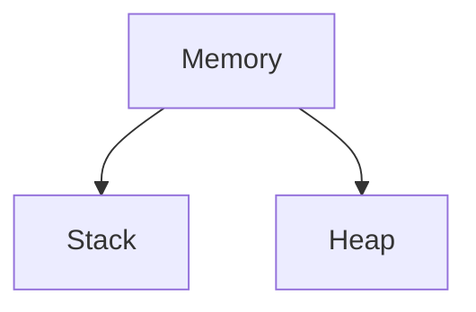
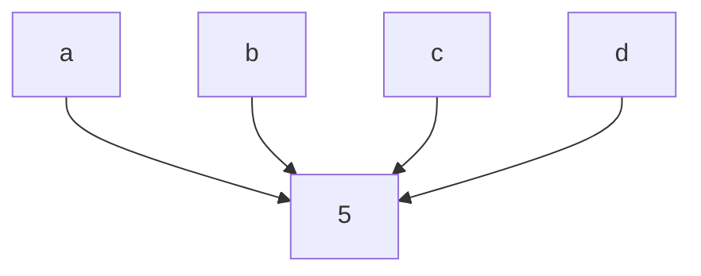

# (Basics)
# Purpose of programming languages
	
    Programming languages were introduced to bridge the gap between human logic and machine execution, allowing humans to communicate instructions to computers in a more intuitive and efficient manner. Their primary purpose is to provide a readable and structured way to write software, abstracting the complexities of hardware and low-level binary code. By offering various levels of abstraction, error handling, and a rich set of libraries and tools, programming languages enhance productivity, portability, and maintainability of code. This makes it possible to develop a wide range of applications, from simple scripts to complex systems, thereby driving innovation and technological advancement across multiple industries.

# Types of programming languages

## 1. Procedural Programming Languages

	Procedural programming languages organize code into procedures or routines, facilitating a step-by-step approach to problem-solving. They emphasize the sequence of operations and use control structures like loops and conditionals to direct program flow. Examples include C, Pascal, and Fortran.

## 2. Functional Programming Languages

	Functional programming languages focus on evaluating mathematical functions and avoid changing-state and mutable data. They promote immutability and first-class functions, making them ideal for complex mathematical computations and parallel processing. Examples include Haskell, Lisp, and Scala.

## 3. Object-Oriented Programming Languages

	Object-oriented programming languages are based on the concept of "objects," which encapsulate data and behavior within classes. They emphasize principles like inheritance, encapsulation, polymorphism, and abstraction, aiding in building scalable and maintainable applications. Examples include Java, C++, and Python.

# Static vs Dynamic languages

	Static programming languages perform type checking at compile-time, requiring explicit type declarations. This leads to early error detection and potentially more optimized code, as seen in languages like Java, C++, and Swift. The advantage is improved reliability and robust tooling, which helps catch errors early in the development process.
#### example:(java)
	int number = 5;

	Dynamic programming languages perform type checking at runtime, allowing for greater flexibility and ease of use. Variables can change types without explicit declarations, enabling rapid development and prototyping. Examples include Python, JavaScript, and Ruby. However, this flexibility can lead to runtime errors that are harder to predict and debug.

#### example:(python)
	number = 5
	number = "five"

# Memory during assignment

#### Stack:
	 Used for storing function calls and local variables. It operates in a last-in, first-out (LIFO) manner, making it efficient for managing function calls and local data.
#### Heap:
	  Used for dynamic memory allocation, primarily for objects and data structures whose size is not known at compile time. Memory allocation and deallocation are more flexible but can lead to fragmentation and slower access times.
###### usage:
	When we assign `a = 5`:
		When assigning a value like an integer (`a = 5`), `a` is stored in the stack, while the value `5` is stored in the heap. `a` holds a reference to the value `5` in the heap.
	In short, the stack is used for static memory allocation, while the heap is used for dynamic memory allocation.

# More about variables and values

	More than 1 reference variables can point to the same value. And if that value is being changed using any one of the reference variable, then all the other reference variables will get affected.
	if 
	a = [1, 2, 3, 4]
	b = a
	a[0] = 5
	and then if we output the value of `b`, `b` will be `[5, 2, 3, 4]`.

# Garbage Collector

	In Java, garbage collection is an automatic process where the JVM reclaims memory from objects that are no longer in use by the program, preventing memory leaks and ensuring efficient memory usage. It's handled by the JVM's garbage collector, which periodically scans the heap for unreferenced objects and deallocates their memory. This automated process relieves developers from manually managing memory allocation and deallocation.

