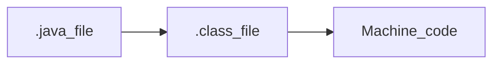
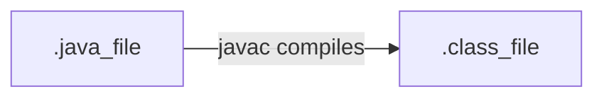
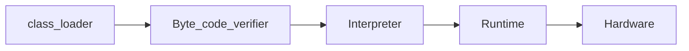

# java code execution

Compiler converts the human readable, '.java' file into '.class' file(byte code).then byte code will be converted to Machine code(0's and 1's) by the interpreter. And these steps cannot be done directly on a system. We need JVM to run this. This is the reason why Java is independent of platforms. (JVM helps in converting the byte code to machine code)

## Platform independence

1. It means that the byte code can run on all operating systems.
2. we need to convert source code into machine code so the computer can understand.
3. compiler helps in doing this by turning it into executable code.
4. this executable code is a set of instructions for the computer.
5. after compiling C/C++ code we get '.exe' file which is platform dependent.
6. in java, we get byte code, JVM will convert this to machine code.
7. Java is platform-independent but JVM is platform dependent.

# Architecture of Java

![[java_architecture.png]]

**JDK** (java development kit) - Provides environment to develop and run java program. It contains, development tools, JRE, a compiler, archiver, docs generator, interpreter/loader.(used to create java program).

**JRE** (java runtime environment) - Provides environment to only run the program. It consists of deployment technologies, user interface toolkits, integration libraries, base libraries and JVM.
After we get .class file, the next things happen at runtime:
1. class loader loads all the classes need for the program to execute.
2. JVM sends code to byte code verifier to check the format of the code.

### Compile time

### Runtime

### (How JVM works) class loader

1. Loading
- reads .class file and generates binary data
- an object of this  class is created in heap.
2. Linking
- JVM verifies the .class file.
- allocates memory for class variables and default values.
- replace symbolic references from the type with direct references.
3. Initialization
- all static variables are assigned with their values defined in the code and static block.

JVM contains the stack and heap memory allocations.

#### JVM execution
4. Interpreter
- line by line execution
- when one methos is called many times, it will interpret again and again.
5. JIT(Just-In-Time)
- those methos that are repeated, JIT provides direct machine code. So, re-interpretation is not required.
- makes execution faster.

### Overall flow of java code

