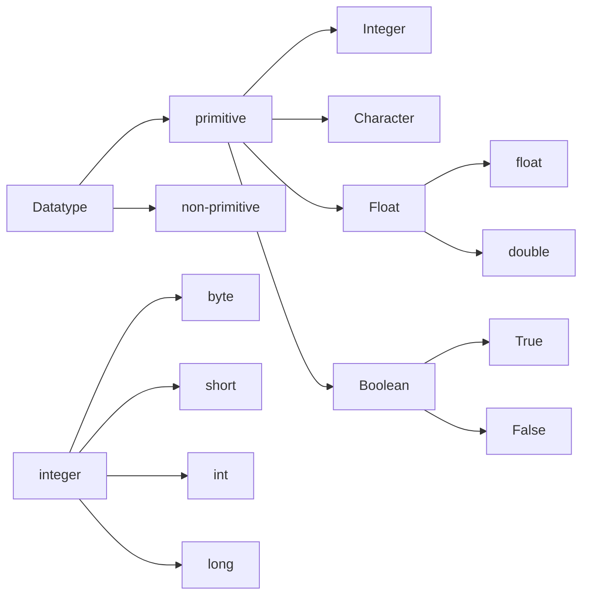

## Variables

variable is a container to store a data of any type. It can be named by considering some constraints. Java is is strictly types language. this means that before storing a data inside a variable, we have to mention what is the type of data that you prefer to store. this is called data type of a variable.

```java
int num = 10;
```

here, equal to is the assignment operator which assigns the right side data to left side variable. The type of the variable (datatype) is mentioned before the variable name and all the statement in java ends with a semicolon.

#### java code to add two numbers

```java
class Addition{
	public static void main(String a[]){
		int num1 = 2;
		int num2 = 3;
		System.out.print(num1+num2);
		
		/*
		(or) 
		int result = num1+num2;
		System.out.print(result);
		*/
	}
}

//output: 5
```

### Rules for naming a variable

- **Start with a letter or underscore**: Must begin with a letter (a-z, A-Z) or an underscore (\_).
- **Subsequent characters**: Can include letters, digits (0-9), underscores (\_), and dollar signs ($).
- **Case-sensitive**: `myVariable` and `myvariable` are different.
- **No reserved keywords**: Cannot use Java reserved words (e.g., `class`, `public`).
- **Descriptive**: Use meaningful names for readability.
- **Camel case**: Common practice is to start with a lowercase letter and capitalize subsequent words (e.g., `myVariableName`).

## Data types




#### Memory sizes

1. **byte**: 1 byte
    
    - Range: -128 to 127
2. **short**: 2 bytes
    
    - Range: -32,768 to 32,767
3. **int**: 4 bytes
    
    - Range: -2,147,483,648 to 2,147,483,647
4. **long**: 8 bytes
    
    - Range: -9,223,372,036,854,775,808 to 9,223,372,036,854,775,807
5. **float**: 4 bytes
    
    - Range: Approximately ±3.40282347E+38F (6-7 significant decimal digits)
6. **double**: 8 bytes (default for values with decimal points)
    
    - Range: Approximately ±1.79769313486231570E+308 (15 significant decimal digits)
7. **char**: 2 bytes (Java follows Unicode)
    
    - Range: '\u0000' (or 0) to '\uffff' (or 65,535 inclusive)
8. **boolean**: 1 byte (Note: Actual size in memory can be JVM-dependent)
    
    - Values: `true` or `false` (no numeric range)


#### Example

```java
public class Main{
	public static void main(String[] args){
		int num1 = 10;
		byte by = 127;
		short srt = 558;
		long l = 5854l;

		float = 5.8f;
		double = 5.8;

		char c = '8';
		char ch = 'd'; //single quotes only

		boolean b = true;
	}
}
```


## Literals


Literals are fixed values written directly in code to represent constants like numbers (e.g., `123`), characters (e.g., `'A'`), strings (e.g., `"Hello"`), or boolean values (`true` or `false`).

```java

public class Main{
	public static void main(String[] args){
		int num1 = 0b101;  //(binary number)on printing it,Output : 5.
		int num2 = 0x7E; //(Hexadecimal) Output: 126
		int num3 = 100_00_00_0_000 // Output: 10000000000

		double dble = 56; //Output: 56.0
		double num4 = 12e10 //Output: 1.2E11

		boolean bln = 1; // error

		char ch = 'a';
		ch++;
		// on printing it, Output : b
	}
}
```


## Type conversions and casting

- Type conversion - implicit(done by the machine)
- Type casting - explicit(manual conversion by programmer)

#### Example:

1.   byte b = 127;
	int a = 257;
	 b = a;            //not possible(range exceeds)
	 a = b;           //possible
2.   byte b = 127;
	int a = 12;
	 b = a;            //not possible
	 a = b;           //possible(conversion)
	 // (in this case, it gives error but it is within the range. So, you can convert it explicitly)
	 b = (byte)a; //casting

Generally small sized datatypes can be assigned to large sized datatypes. It happens by implicit conversion.
Large sized datatypes can be assigned to small sized datatypes when it is within the range of small datatype. It happens by explicit casting.
boolean cannot be converted into char and viceversa is also not possible.


3.   int x = 5.6;    //error
	 float a = 5.6f;
	 int b = (int)a;    //output: 5 (we will loose 0.6) 
4. consider the example 1, if we convert a to byte explicitly, then we will get the output :1.
This is because, 257%256 = 1.  here, 256 is the total range of byte datatype.

#### Type promotion

5.   byte a = 10;
	byte b = 30;
	 int c = a\*b;
	 // multiplication of two byte values can be stored in integer datatype. 10\*30 = 300,
	 which exceeds the range of bytes. This is called type promotion.
	 