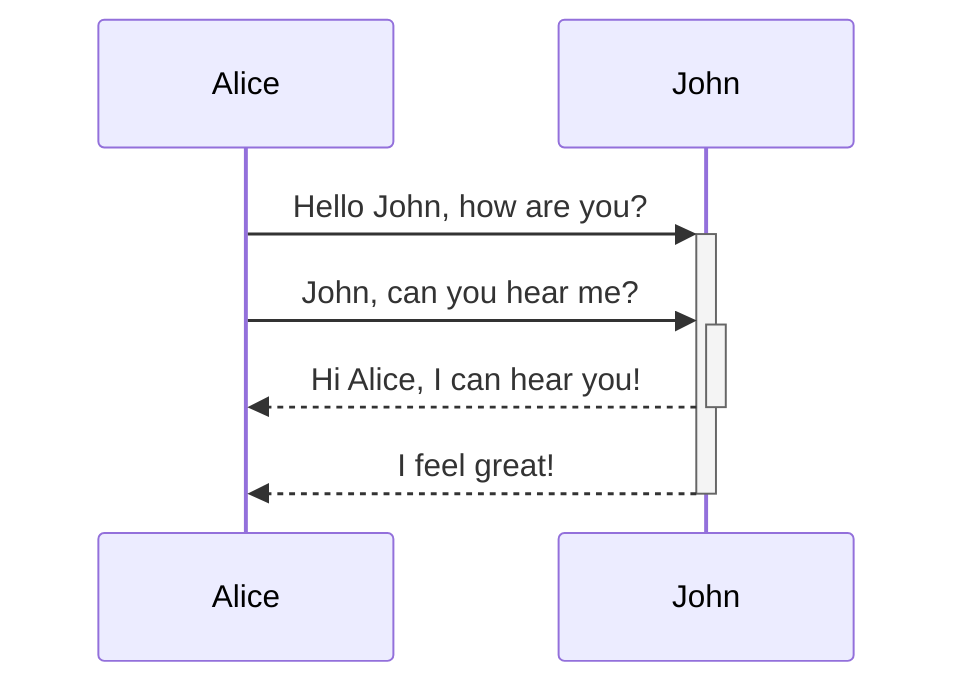

# Basic Formatting Syntax
******
1. **Paragraphs:** Use blank lines to separate paragraphs. For example:

**Syntax:**

This is a paragraph.

This is another paragraph.

**Output:**

This is a paragraph.

This is another paragraph.

******

2. **Headings:** Create headings with up to six # symbols. For example:

**Syntax:**

\# Heading 1

\## Heading 2

\### Heading 3

\#### Heading 4

**Output:**

# Heading 1

## Heading 2

### Heading 3

#### Heading 4

*****

3. **Bold, Italics, Highlights:** Use **bold**, *italics*, and ==highlighted== text. For example:

**Syntax:**

\*\*This is bold text.\*\* \_This is italic text.\_ \=\=This is highlighted text.\=\=

**Output:**

**This is bold text.** _This is italic text._ ==This is highlighted text.==

******

4. **Internal Links:** Use [[Wikilinks]] or [Markdown links](Note.md) to link to other notes. For example:

**Syntax:**

\[\[Obsidian Flavored Markdown\]\]

\[Markdown links\]\(https://chatgpt.com/Note.md\)

**Output:**

[[Obsidian Flavored Markdown]]
[Markdown links](https://chatgpt.com/Note.md)

******

5. **External Links:** Create inline links to URLs. For example:

**Syntax:**

\!\[Engelbart\]\(https://history-computer.com/ModernComputer/Basis/images/Engelbart.jpg \)

**Output:**


*******


6. **Quotes:** Format quotes with > symbols. For example:

**Syntax:**

\> Human being face a lot of problems in their life.

**Output:**

> Human being face a lot of problems in their life.

******

7. **Lists:** Create unordered and ordered lists. For example:

**Syntax:**

\- First item

\- Second item

	\-Nested item


\1. First item

\2. Second item

**Output:**
- First item
- Second item
    - Nested item

1. First item
2. Second item

******

8. **Task Lists:** Use - [x] for completed tasks and - [ ] for incomplete tasks. For example:

**Syntax:**

\- \[x\] This is a completed task.
\- \[ \] This is an incomplete task.

**Output:**

- [x]  This is a completed task.
- [ ]  This is an incomplete task.

******

9. **Horizontal Rule:** Use three or more Asterisk, -, or _ for a horizontal line. For example:

**Syntax:**

\*\*\*\*\*\*

**Output:**

output is a horizontal seperating line

******

10. **Code:** Format code with backticks or code blocks. For example:

**Syntax:**

\`\`\`js
function fancyAlert(arg) {

	if(arg) {
 
		$.facebox({div:'#foo'})
  
	}
 
}
\`\`\`

**Output:**

```js
function fancyAlert(arg) {
	if(arg) {
		$.facebox({div:'#foo'}) 
	} 
}
```


******

11. **Comments:** Format code with \%\%. For example:

**Syntax:**

\%\%

This is a block comment. 

Block comments can span multiple lines.

\%\%

**Output:**

%% 
This is a block comment. 

Block comments can span multiple lines. 
%%

******
# Advanced Formatting Syntax
******
12. **Tables:** Create tables using vertical bars (|) and hyphens (-). For example:

**Syntax:**

\| Header 1 \| Header 2 \|  
\| -------- \| -------- \|  
\| Data 1   \| Data 2   \|

**Output:**

| Header 1 | Header 2 |
| -------- | -------- |
| Data 1   | Data 2   |

******

13. **Diagrams:** Use Mermaid for creating diagrams. For example:

**Syntax:**

\`\`\`mermaid 

sequenceDiagram 

	Alice-\>\>\+John: Hello John, how are you? 
 
	Alice-\>\>\+John: John, can you hear me? 
 
	John--\>\>-Alice: Hi Alice, I can hear you! 
 
	John--\>\>-Alice: I feel great! 
 
\`\`\`

**Output:**




******

14. **Add a Tag:** Use # followed by a keyword. For example:

**Syntax:**

\#meeting

**Output:**

#meeting


15. 18. **Nested Tags:** Create hierarchies with forward slashes (/) in tag names. For example:
**Syntax:**

\#inbox\/to-read

**Output:**

#inbox/to-read


*****

### To know more about obsidian and Markdown [Visit Site](https://help.obsidian.md/Home)

